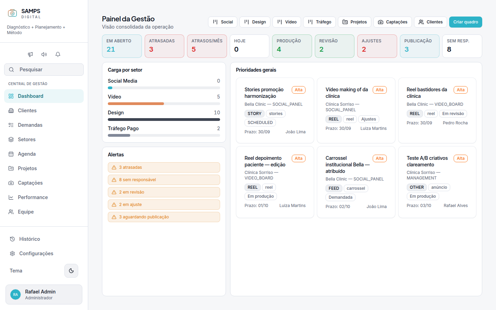
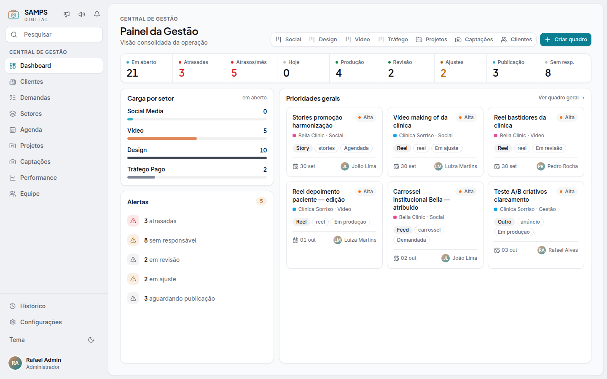
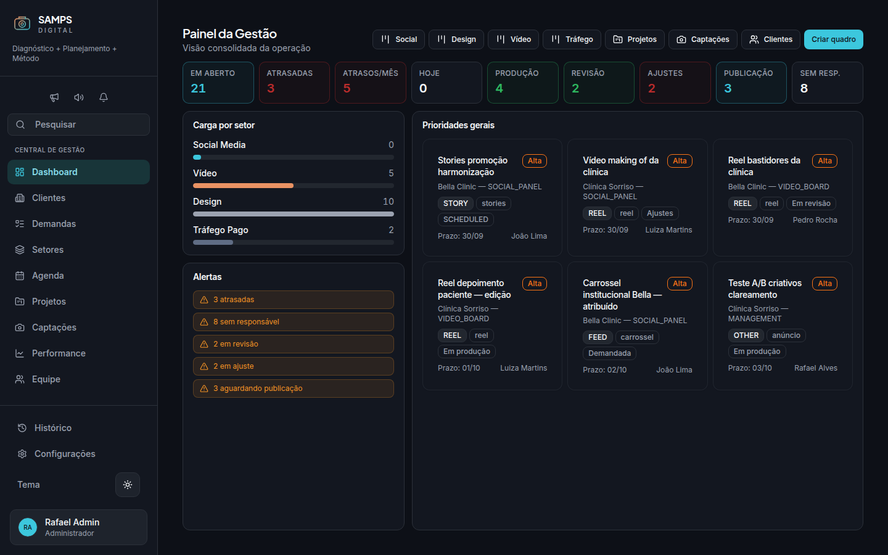
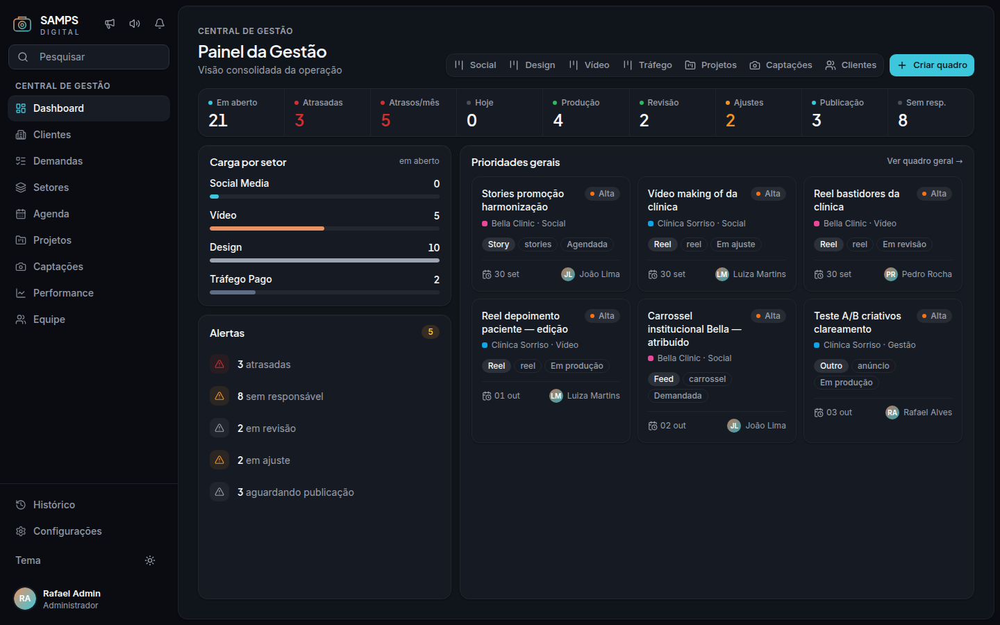
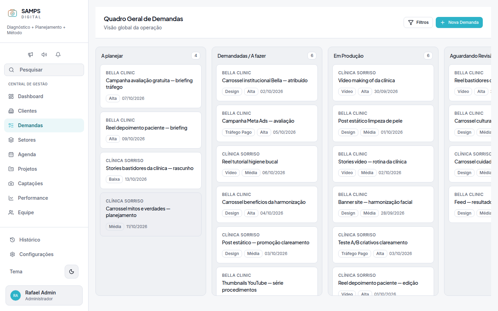
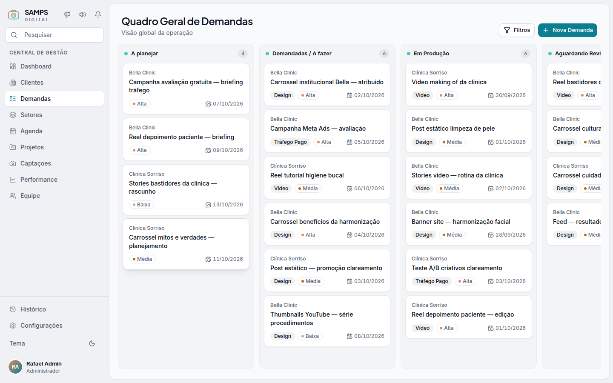

# Referências de design — "tirar a cara de nativo"

**Data:** 2026-09-29
**Origem:** feedback de que o Samps OS "parece muito nativo", ou seja, parece o template padrão do shadcn/ui.
**Uso:** base da spec `docs/superpowers/specs/2026-09-29-visual-acabamento-design.md` e das próximas fatias visuais.

> Behance, Dribbble, Pinterest, linear.app, muz.li e designmd.co estão **bloqueados pelo proxy** do ambiente cloud.
> As referências dessas fontes vieram de busca (título, descrição e padrões citados).
> Os tokens exatos vieram de DESIGN.md públicos no GitHub (`educlopez/design-bites`).

---

## 1. Diagnóstico do estado anterior (screenshots de 29/09)

Telas capturadas: login, painel de gestão, demandas, clientes, agenda, equipe, performance, setores e configurações. Cada uma em claro, escuro e mobile (390px).

| # | Sintoma | Por que parece "nativo" |
|---|---------|-------------------------|
| 1 | Toda superfície é `bg-white + border 1px cinza`, sem elevação | É o default do shadcn. Sem hierarquia de profundidade, tudo pesa igual |
| 2 | KPIs com **borda e fundo coloridos** (verde, vermelho, ciano) | Lembra alerta de Bootstrap. Nove cores competindo, e o número some |
| 3 | Botão primário ciano `#2DB2C7` com texto branco, **contraste 2.5:1** | Reprova no WCAG AA (mínimo 4.5:1). Parece desbotado/"lavado" |
| 4 | Enums crus na tela: `SOCIAL_PANEL`, `SCHEDULED`, `STORY`, `OTHER` | Denuncia o banco na UI. Sinal forte de ferramenta inacabada |
| 5 | Chips de tipo/prioridade como caixas com borda (`Alta`, `Design`) | Etiqueta genérica. Sem ponto de cor nem forma de pílula |
| 6 | Sidebar branca com borda dura e 3 blocos separados por linhas | Layout admin-template. Tagline de 2 linhas e ícones espalhados |
| 7 | Cabeçalhos de página com linha divisória e título `text-xl` | Hierarquia fraca. A linha corta a página sem necessidade |
| 8 | Alertas como caixas laranjas empilhadas | Ruído visual. Tudo tem o mesmo peso, até o que é neutro |
| 9 | Tabelas com header `text-sm` normal e `p-4` | Densidade de formulário, não de ferramenta |
| 10 | Performance: rótulos em caixa alta colando (`CONCLUÍDASEM PRODUÇÃO`) | Quebra visível de layout |

## 2. Referências e o que tiramos de cada uma

### Produtos (padrão ouro de ferramenta B2B)

| Referência | Fonte | O que aplicamos |
|------------|-------|-----------------|
| **Linear**: redesign 2024 | [How we redesigned the Linear UI (part II)](https://linear.app/now/how-we-redesigned-the-linear-ui) · [resumo (Roger Wong)](https://rogerwong.me/2024/11/how-we-redesigned-the-linear-ui-part-ii) | Sidebar um tom abaixo do conteúdo, menos ruído em sidebar/header, e mais densidade e hierarquia na navegação. Tema derivado de poucos tokens (base, accent, contraste) |
| **Linear**: anatomia do card | [Linear design.md (superdesign)](https://superdesign.dev/design-systems/linear) | Card do Kanban: cliente, título e linha de chips (prioridade com ponto, rótulo em pílula, prazo com ícone). Borda fina e raio ~9px |
| **Vercel Geist** | [Geist Materials](https://vercel.com/geist/materials) · [DESIGN.md](https://github.com/educlopez/design-bites/blob/main/design-mds/vercel.com/DESIGN.md) | **Sombras em camadas** (anel 1px + queda curta + ambiente) em vez de uma sombra difusa. Raio 6px em controles e 12px em cards. Fundo `#FAFAFA` com card `#FFF`. Hover sem transformação exagerada |
| **Amie** | [DESIGN.md](https://github.com/educlopez/design-bites/blob/main/design-mds/amie.so/DESIGN.md) | Elevação por níveis (card: anel 6% + 2 quedas curtas; modal: 4 camadas). Raio em escala 3/6/8/12/pill |
| **Attio** | [Mobbin: paleta](https://mobbin.com/colors/brand/attio) · [SaaSFrame](https://www.saasframe.io/saas/attio) · [DESIGN.md](https://github.com/educlopez/design-bites/blob/main/design-mds/attio.com/DESIGN.md) | Neutros calibrados com **uma** cor de ação. Inter com stylistic sets (`ss03`) para fugir do Inter "cru". Botão outline que escurece a borda no hover |
| **shadcn Sidebar inset** | [Inset variant](https://www.shadcn.io/blocks/sidebar-inset-variant) | Conteúdo como **painel elevado com cantos arredondados** sobre o shell (padrão de Linear, Notion e Arc) |

### Galerias (tendência 2026)

| Referência | Fonte | Observação |
|------------|-------|------------|
| Tasklyn: SaaS & Project Management Dashboard | [Behance](https://www.behance.net/gallery/244573141/Tasklyn-SaaS-Project-Management-Dashboard-UI-Kit) | Dashboard de projetos em cards neutros com gráficos. Auto-layout consistente |
| PlanIQ / Flowza / Taski | [Behance: busca "project management ui saas"](https://www.behance.net/search/projects/project%20management%20ui%20saas) | Kanban com cards brancos elevados sobre coluna tingida, avatares e chips em pílula |
| Taskify / Taskmanly (Kanban View) | [Dribbble: Taskify](https://dribbble.com/shots/25030400-Taskify-Project-Management-Dashboard-Kanban-View) · [Dribbble: Taskmanly](https://dribbble.com/shots/22971572-Taskmanly-Project-Management-Dashboard-Kanban-View) | Coluna com ponto de status + contador em pílula. Card com hover-lift |
| Kanban dashboard tag | [Dribbble tag](https://dribbble.com/tags/kanban-dashboard) | slothUI: minimalismo com acentos em gradiente |
| Bento grid / Dashboard UI 2026 | [Pinterest: Bento Grid UI](https://www.pinterest.com/taqwah_agency/bento-grid-ui-ux-design-bento-branding-ideas/) · [Pinterest: Dashboard UI 2026](https://in.pinterest.com/taqwah_agency/dashboard-ui-design-best-saas-trends-2026/) | Módulos de tamanhos distintos, tipografia forte e gradiente só como acento |
| 176 SaaS dashboards | [SaaSFrame](https://www.saasframe.io/categories/dashboard) · [bento pattern](https://www.saasframe.io/patterns/bento-grid) | "Superfície certa na hierarquia certa, com o mínimo de ruído" |

### Boas práticas de KPI

| Fonte | Regra aplicada |
|-------|----------------|
| [Anatomy of the KPI Card](https://nastengraph.substack.com/p/anatomy-of-the-kpi-card) · [Tabular Editor: KPI cards](https://tabulareditor.com/blog/kpi-card-best-practices-dashboard-design) | Ordem rótulo → valor (→ delta → período). Cards iguais para não exigir reaprendizado. Cor só onde há significado |

## 3. Tokens extraídos (referência crua)

```text
Vercel  sombra base    0 0 0 1px rgba(0,0,0,.08)
        sombra menu    base + 0 1px 1px #00000005, 0 4px 8px -4px #0000000a, 0 16px 24px -8px #0000000f
        sombra modal   base + 0 1px 1px #00000005, 0 8px 16px -4px #0000000a, 0 24px 32px -8px #0000000f
        raio           6px controles · 12px cards · 9999px pills
        fundo          #FAFAFA página · #FFFFFF card · #F2F2F2 rebaixado
Amie    card           0 0 0 1px rgba(0,0,0,.06), 0 1px 1px -.5px rgba(0,0,0,.06), 0 3px 3px -1.5px rgba(0,0,0,.06)
        raio           3 / 6 / 8 / 12 / pill
Linear  card kanban    raio 9px · borda hairline · título 12–13px medium · chips 24px
Attio   neutros        #FFF · #F5F5F5 · texto #1A1A1A / #6B7280 · borda #E5E7EB · 1 cor de ação
```

## 4. O que **não** copiar

- Paleta de terceiros: a Samps mantém Ink/Paper/Cyan/Ember (spec de 24/08).
- Serif editorial (Tiempos, da Attio): não combina com o tom operacional B2B/B2G.
- Glassmorphism e gradiente em tudo: gradiente Ember→Cyan fica no logo, no avatar e em no máximo uma CTA "hero" por view.
- Bento assimétrico decorativo: o painel é ferramenta de leitura rápida, não vitrine.

## 5. Antes / depois

| Tela | Antes | Depois |
|------|-------|--------|
| Painel (claro) |  |  |
| Painel (escuro) |  |  |
| Demandas (claro) |  |  |
